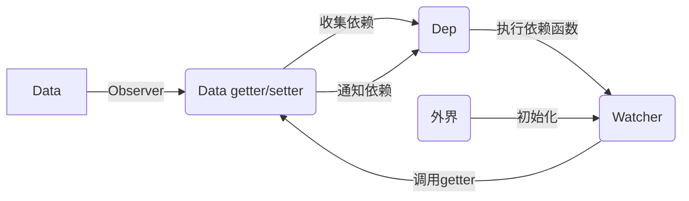

## 本节内容
Vue通过`Object.defineProperty()`绑定到数据的每一项上，从而监听数据的变化，并在捕获到变化时更新视图。
## 目标
通过`Object.defineProperty()`完成对data的数据绑定，在修改data的内容后给出响应：
```js
const app = new Vue({
  data: {
    text: 'hello world'
  }
})
```
## 实现思路
Vue实现的数据绑定可以拆分出以下几个模块：
- Data  
就是你传入的数据，本身并没有什么不同，就是一个普通的JavaScript对象
- Observer  
负责将你传入的data的每一项属性添加上getter/setter，通过defineReactive函数实现
- Depend  
每个属性在改变时，都要执行一个函数进行View层的刷新，我们还没进行到那一步，就简单的理解为这个函数就是console.log了一点内容吧。这个函数就是这个属性的依赖函数，Depend负责保存每个属性的依赖，可以在getter收集依赖，在setter的时候执行依赖。
- Watcher  
依赖本赖，实例化时传入对象的某个属性还有这个属性触发时调用的函数，他会自动把依赖送进Dep中(其实就是把自己放进一个全局变量中，然后getter一个对应的属性，getter监听到调用后，就把当前全局变量中的依赖放进Dep中)。
