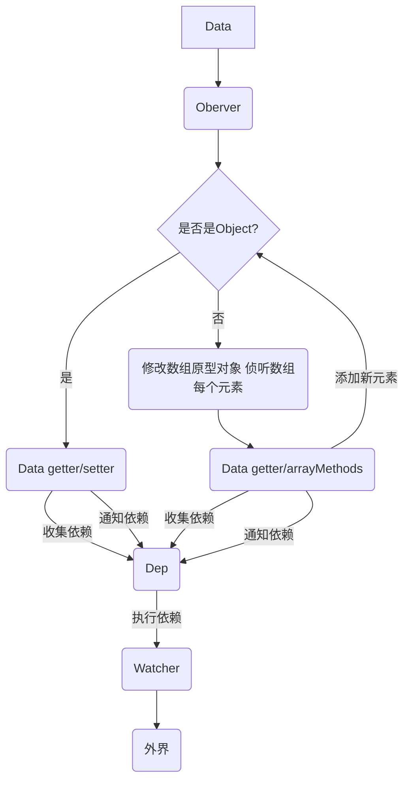

## 本节内容
上一节讲了`Object`数据的侦听，是通过`Object.defineProperty()`实现的。`Array`无法通过上述方法实现，因为数组除了通过赋值修改数据外，还能通过push、pop、shift等方法修改数组。Vue给出的方法是，重写这些修改数组的方法，这样Vue就能够知道用户在何时调用了这些方法，以实现数据侦听。
## 目标
实现对Array的侦听，在修改数组时给出提示：
```js
const app = new Vue({
  data: {
    text: 'hello world',
    array: [{a:1}]
  }
})
```
## 实现思路
我们已经实现了对Object数据的侦听，只需要对之前的代码稍加修改，就可以实现对Array的监听了：
1. 新建一个以Array为原型的对象arrayMethods，在这个对象上提供push、pop、shift、unshift、sort、reverse、splice方法，我们可以把data中的数组的原型改为arrayMethods，这样在调用数组的上述方法时，就会调用到arrayMethods上对应的方法，我们就可以对这些数组操作进行监听了。
2. 给通过Observer监听的每个属性都加上一个`__ob__`属性，指向Observer本身，在Observer身上提添加一个监听array的方法，可以给数组的每个元素加上监听，Observer上面也要保存Dep，因为数组的setter不在defineReactive里面触发。
3. 通过arrayMethods可以监听到数组变化，对于push、unshift和splice操作，需要对新加入的元素转化为可监听元素，好在每个属性都有__ob__属性，上面有observeArray方法可以监听数组的每一项。完成后通过__ob__通知依赖。
4. 通过数组下标修改元素、通过修改数组长度修改数组并不能够监听的到，因为这些操作不会触发setter，也不会触发我们重写的函数。  
我们可以把Object和Array整理到一张流程图里，方便理解：
