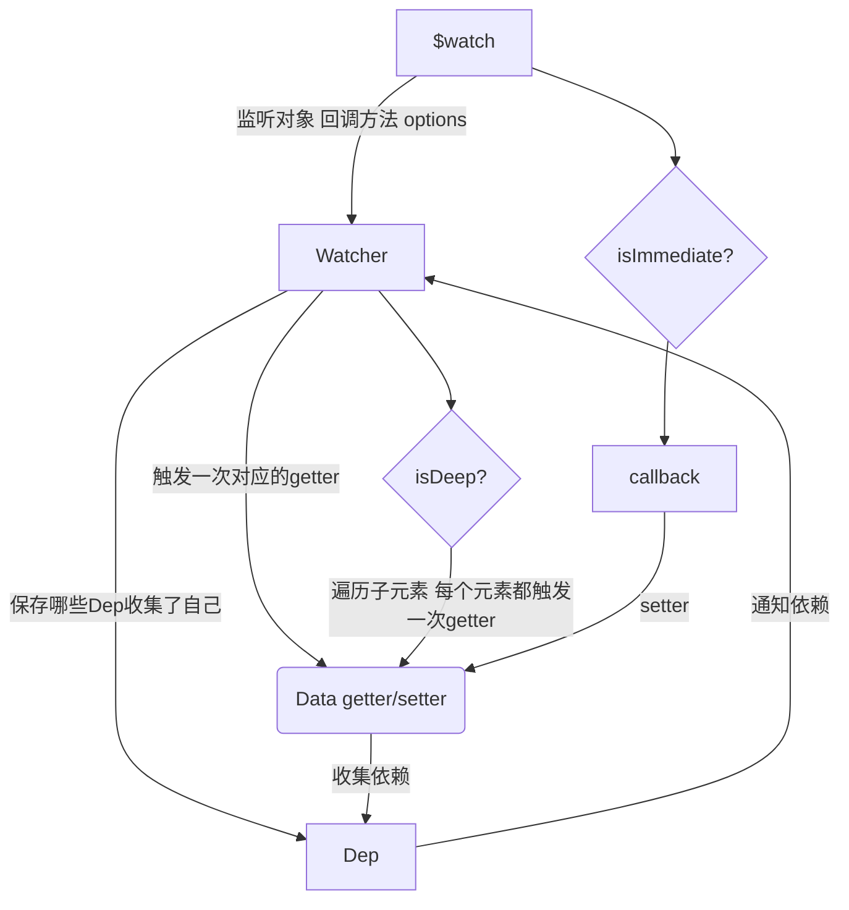

## 本节内容
Vue中的`$watch`可以监听data中数据的变化，这一节就来实现一个`$watch`。`$watch`基本上是依赖Watcher实现的，在Watcher中接收deep参数，如果为true就访问每个子元素，这样访问时就会给每个子元素加上依赖。  
Watcher中还有一个deps属性，是个数组，用来收集哪个Dep添加了自己，这样在销毁`$watch`的时候可以追踪到添加了自己的Dep，用以清除自己。  
Dep在初始化时给自己赋值一个唯一的id，这样Watcher把Dep实例添加到自己的deps列表中时，可以避免添加了重复的Dep(Dep也能避免添加重复依赖)。
## 目标
实现下面给出的用法：
```js
vm.$watch('text',function (newval, oldVal) {
    console.log('text被修改了', newval, oldVal)
  },
  {
    immediate: true,
    deep: true
  }
)
```
## 实现思路
前两节实现的Watcher是有缺陷的，因为每次调用getter都会往Dep中添加一个依赖，即使是同一个依赖，也会添加多次，先更改上一节的代码，使得Watcher能够过滤掉相同的依赖。然后我们画一下$watch的流程图。
