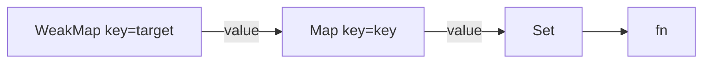
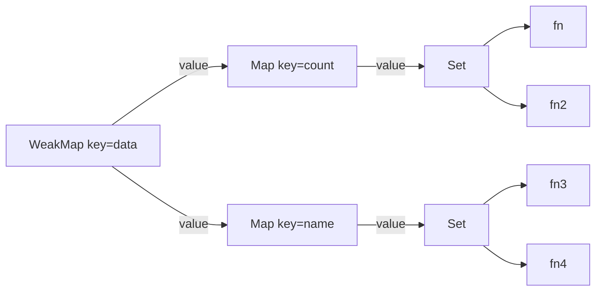
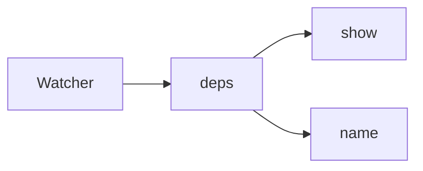
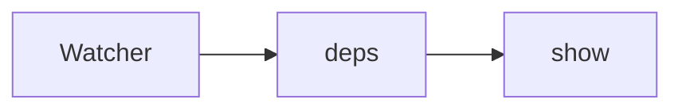

# 透过Vue2看Vue3，详解Vue3的响应式原理
我们都知道，Vue2中的响应式是通过数据劫持和消息发布订阅实现的，而数据劫持主要是通过`Object.defineProperty`实现的(数组通过改写数组方式实现)。而在Vue3中，数据劫持通过Proxy实现。
## Proxy
我们可以通过实例化一个proxy对象来对数据进行监听，当代理对象被读取或修改时，能通过代理对象的getter/setter拦截这个操作，我们可以在这里进行一些操作(比如说更新DOM)，再返回原来的对象值：
```js
// 定义源数据
const data = {
  name: 'zs',
  age: 18
}

// 定义代理对象
const proxy = new Proxy(data, {
  // 拦截读取操作
  get(target, key) {
    console.log('数据被读取了')
    return traget[key]
  },
  // 拦截设置操作
  set(target, key, newVal) {
    target[key] = newVal
    console.log('数据被修改了')
  }
})
```
上述代码就实现了一个简单的数据劫持，现在我们能思考下数据被读取和修改时分别应该做什么？在Vue2中，数据被读取时会将当前的订阅者放进订阅器中，数据被修改时，会把当前数据的订阅器中的订阅者取出来并执行。这里其实很好理解，就是数据需要知道谁访问了自己，这样当数据更新时才能通知到那些曾经访问了自己的人。但并不是所有的访问都会放进订阅器：
```js
<template>
  <div>{{ count }}</div>
</template>
export default {
  data {
    count: 1,
    unit: 'yuan'
  },
  mounted() {
    console.log(this.count)
  }
}
```
如上述代码，页面和mounted都访问了count，但当count改变时，需要通知页面，却不需要通知mounted，因为mounted中并不需要对count的改变做出响应。这个逻辑Vue3是通过在全局变量上注册副作用函数来实现的，如果访问count时，存在副作用函数，则将副作用函数放进count的“桶”(用来存在副作用函数的容器)中，反之，访问时没有全局副作用函数，则直接返回值。
## 副作用函数
上文我们有提到过，并不是所有对proxy的访问都会存在副作用函数，我们先来考虑什么是副作用函数以及如何在全局注册副作用函数。我们接着使用上边的例子，`template`中使用了count属性，在count变化时，我们需要更新DOM，假设DOM是通过下面的函数更新的：
```js
function effect() {
  document.getElementByTag('div')[0].innerText = count
}
```
这样，只要我们在count变化后调用这个函数，就可以实现DOM的实时更新了。这个effect函数就叫做副作用函数，我们并没有直接修改DOM，而是修改count之后带来的**副作用**。  
其实直接把这个函数丢进proxy的setter中就能实现这个效果，但是这样有个问题，proxy代理的是整个data对象，data中除了count属性还有name属性，我们修改name也会触发setter，我们期望的是哪个属性的副作用函数，只在其对应的属性更新时调用。  
在Vue2中，每个属性都有自己的`__ob__`对象，可以理解为该属性的观察者，当该属性发生变化时，观察者会通知该属性的订阅器，进而通知到所有的订阅者。Vue3中实现的方法类似，每个属性都维护了一个存储副作用函数的`桶`，当属性发生变化时，将`桶`里的函数拿出来执行。  
有了大概思路，我们先来解决最开始问题，如何将副作用函数放进对应属性的`桶`中？  
我们先来回忆下Vue2中的订阅者(怎么又是Vue2？)，Vue2中的每个component都会有一个Watcher对象，用以在数据发生变化时执行render函数重新获取虚拟DOM，然后再update到页面上，看起来好像做了很多操作，其实就是在初始化Watcher实例时传入了一个函数(这不就是Vue3的副作用函数么)。在实例化Watcher时，我们可以传入一个属性或者一个函数，Watcher会访问该属性(或者执行该函数)，当属性被访问时(或函数中的属性被访问时)，就将Watcher放进被访问属性的订阅器中。这不就是我们想要的效果吗？在属性被访问时将副作用函数放进属性的`桶`中，属性被修改时再执行`桶`里面的函数:
```js
let activeEffect
function effect(fn) {
  activeEffect = fn
  fn()
}

// 存放属性的key以及它的副作用函数们
const keyMap = new Map()
const proxy = new Proxy(data, {
  get(target, key) {
    if(!activeEffect) return traget[key]
    targetMap.set(key, activeEffect)
    return traget[key]
  },
  set(target, key, newVal) {
    target[key] = newVal
    const effect = targetMap.get(key)
    effect&&effect()
  }
})

effect(()=>{
  document.getElementByTag('div')[0].innerText = count
})
```
这样我们就实现了，将副作用函数注册在全局变量中，在访问属性时将副作用函数放进数据的桶中，修改时从桶中拿出副作用函数并执行。  
但是上面的例子有很多问题，就是桶里面只能放一个副作用函数，这个好解决，可以放到一个数组中嘛。还有个问题，这时候再代理一个data2，并且data2上也有个count属性，就不行了。我们先来看下Vue2中是如何处理这个问题的。
### 存储副作用函数的容器  
在Vue2中，每一个属性都会通过defineProperty方法重新定义在_data上，并且通过闭包在defineReactive方法中给每一个属性都新建了自己的订阅器，所以Vue2并不存在多个对象统一管理副作用函数的情况(那你看Vue2干啥？)。  
虽然Vue2没有相关问题，但实现起来其实并不复杂，先用一个Map保存对象和对象中的属性的关系，然后再用一个Map保存属性的key和桶的关系，再来一个数组保存对应key的副作用函数。说起来比较啰嗦，其实实现起来很简单：
```js
// key为代理的源对象 value为一个新的Map
const targetMap = new WeakMap()
const proxy = new Proxy(data, {
  get(target, key) {
    if(!activeEffect) return traget[key]

    // 先取出该对象对应的桶
    let depsMap = targetMap.get(target)

    // 没有就初始化
    if(!depsMap) targetMap.set(target, (depsMap=new Map()))

    // 通过key取出该属性所有的副作用函数
    let dep = depsMap.get(key)
    // 如果没有就新建一个桶
    if(!dep) depsMap.set(key, (dep = new Set()))

    // 将副作用函数放进桶里
    dep.add(activeEffect)
    return traget[key]
  }
})
```
好像代码看起来也不是很直观，没事，我们画一个图表示一下：

我们将实际数据带入到上图中：

targetMap之所以是一个WeakMap，是因为data被释放后，其所有的副作用函数都将一并被回收，这个逻辑在Vue2中是通过Watcher上的`teardown`方法实现的。
### 清除副作用函数
上面我们已经实现了一个不错的响应式，无论切换代理对象还是同名key，都能很好的处理，但是还是有问题，我们结合实际的例子看一下：
```html
<template>
  <div class="name">{{show?name:'*'}}</div>
</template>
<script>
  export default {
    data: {
      name: 'zs',
      show: true
    }
  }
</script>
```
上面的代码很容易就能翻译成一个副作用函数：
```js
effect(()=>{
  document.getElementByTag('div')[0].innerText = proxy.show ? proxy.name : '*'
})
```
当通过effect函数注册这个副作用函数时，会将其放在全局的变量中，当执行副作用函数时会访问`proxy.show`和`proxy.name`，并将副作用函数放进这两个属性的`桶`中。  
乍一看好像没什么问题，修改show和name都会触发副作用函数，然后重新渲染DOM。但当show为false时，无论name怎么变，页面都不会产生变化，但仍然会调用副作用函数。我们期望的是，如果该副作用函数不再依赖name这个属性，那么name产生变化时就不再调用。  
我们在上文提到过，在Vue2中，实例化Watcher时，Watcher会将自己注册到一个全局变量中，再访问实例化时传入的属性(或函数)，访问该属性(或函数中的属性)时，会触发该属性的getter，进而把Watcher实例放进该属性的订阅器中。这个过程叫做`收集依赖`，收集完成后，Watcher会将自己从全局变量中删除，之后会进行一步操作，叫做`cleanupDeps`。  
要搞清楚`cleanupDeps`做了什么，我们需要先弄清楚Dep(订阅器)和Watcher(订阅者)之间的关系。当属性被访问时，会将当前的Watcher添加到属性的Dep中，同时，Watcher也会维护一个deps属性，保存着添加了自己的Dep。听起来有点绕，其实就是互相存储，你中有我，我中有你......  
Dep中保存着Watcher好理解，毕竟属性发生改动后需要通知Watcher，但是为什么Watcher里面还要保存Dep？其实上文中我们提到过，Watcher中有一个`teardown`方法，用于在component被销毁时从deps列表移除自己。除了`teardown`，就是我们上面提到的`cleanupDeps`方法了，Watcher会在每次属性的getter触发，将自己添加进该属性的订阅器中，同时重新计算一遍谁依赖的自己，放进newDeps中，当getter操作结束时，用newDeps中的数据替换掉deps中的数据。换句话说，每次触发访问，Watcher都会保留该次被访问了的属性的订阅器，清空其余的订阅器。这样说可能有点不容易理解，我们画个图表示一下：

当上述副作用函数运行时，会访问show和name两个属性，故Watcher的deps中会存在两个属性的订阅器。

当把show赋值为false时，触发了show的setter，会通知show属性的订阅器，更新所有订阅者。继而Watcher会重新调用上面的函数，这时show已为false，不会再次访问name属性，所以该次访问形成的newDeps里只包含show的订阅器，当访问完成时会将Watcher的deps赋值为newDeps(不光是赋值为newDeps就行，还需要将订阅器里面对Watcher的依赖也删除，毕竟这两位相互保存，删除也要相互删除)，这时就只有show的订阅器包含Watcher了，当我们再次修改name时便不会触发Watcher。  
弄清楚了Vue2的实现，再来实现Vue3的清除副作用函数的逻辑，就简单多了。  
在上面的代码中，我们已经实现了对某个属性维护一个dep(一个Set)，里面存放着与该属性有关的所有副作用函数，接下来要做的就是要副作用函数知道自己被谁收进了dep中，然后在被触发时将最新的dep记录下来，替换掉原来的。不过，这里Vue3的逻辑与Vue2不同，它在触发之前把dep清空了，然后触发时重新收集，逻辑如下：
```js
function effect(fn) {
  const effectFn = () => {
    cleanupEffect(effectFn)
    // 当effect执行时 设置其为当前激活的副作用函数
    activeEffect = effectFn

    fn()
  }
  effectFn.deps = []
  effectFn()
}
function cleanupEffect(effect) {
  effect.deps.forEach((dep) => {
    dep.delete(effect)
  })

  effect.deps.length = 0
}
```
我们把副作用函数放进一个闭包中(其实源码里是放在了ReactiveEffect对象里，这里简化下方便理解)，将这个函数当作一个新的副作用函数，它会在执行时清楚`桶`对自己的依赖，然后将自己设置为当前激活的副作用函数，再执行原副作用函数。  
我们还需要再完善一下getter，因为之前getter只实现了将副作用函数添加到属性的`桶`中，却没有将这个桶放进副作用函数维护的数组中：
```js
const proxy = new Proxy(data, {
  get(target, key) {
    if(!activeEffect) return traget[key]

    let depsMap = targetMap.get(target)
    if(!depsMap) targetMap.set(target, (depsMap=new Map()))
    let dep = depsMap.get(key)
    if(!dep) depsMap.set(key, (dep = new Set()))
    dep.add(activeEffect)
    
    // 将dep添加到当前副作用函数的deps中
    activeEffect.deps.push(dep)
    return traget[key]
  }
})
```
setter也需要修改，当数据被修改时，我们在setter中实现了对其所有副作用给函数的调用，也就是说直接把该属性维护的`桶`中的副作用函数挨个调用一遍就行了：
```js
const proxy = new Proxy(data, {
  set(target, key, newVal) {
    target[key] = newVal

    const depsMap = targetMap.get(target)

    if (!depsMap) return

    const effects = depsMap.get(key)
    // 执行所有副作用函数
    effects.forEach((effectFn) => effectFn())
  }
})
```
上述代码，当setter被触发时，会通过target和key取到该属性维护的`桶`，然后挨个执行`桶`里存放的副作用函数，但是这里有个问题，副作用函数执行时，会先清空依赖，然后触发副作用函数里面的属性，又将自己放进了`桶`里，这样就形成了死循环，一直放一直执行。我们可以用一个新的Set来修复这个问题：
```js 
const proxy = new Proxy(data, {
  set(target, key, newVal) {
    target[key] = newVal
    const depsMap = targetMap.get(target)
    if (!depsMap) return
    const effects = depsMap.get(key)

    // 通过effects创建一个新集合，避免无限循环
    const effectsToRun = new Set(effects)
    // 执行所有副作用函数
    effectsToRun.forEach((effectFn) => effectFn())
  }
})
```
## 完善响应式
上面我们已经实现了基于proxy的响应式，但是在特定情况下还是会出问题，我们还需要一些操作来晚上它。
### 嵌套副作用函数
先来看下面的例子：
```js
export default {
  data: {
    firstName: '三',
    lastName: '张',
    age: 18
  },
  computed: {
    fullName() {
      return this.lastName + this.firstName
    },
    persionInfo() {
      return this.fullName + ' ' + this.age
    }
  }
}
```
虽然我们还没学到computed，但是我们仍可以用一个简单的副作用函数表示computed：
```js
let fullName = effect(()=>{
  return proxy.lastName + proxy.firstName
})
let persionInfo = effect(()=>{
  return fullName + proxy.age
})
```
其中`persionInfo`实际是发生了副作用函数嵌套：
```js
let persionInfo = effect(()=>{
  let fullName = effect(()=>{
    return proxy.lastName + proxy.firstName
  })
  return fullName + proxy.age
})
```
上面的例子不一定对，但是现阶段能表明某些问题。我们把两个副作用函数称为fullName副作用函数和persionInfo副作用函数。在persionInfo副作用函数执行时，其实需要在执行过程中执行fullName副作用函数，这就会出现一个问题，我们全局注册的`activeEffect`在fullName执行时会将persionInfo替换掉，这就导致persionInfo副作用函数无法正确的放进`age`的`桶`中。  
在Vue2中，对Watcher维护了一个订阅者栈，`Dep.target`作为一个全局变量存放当前Watcher，`targetStack`保存着当前正在执行的所有Watcher。当访问开始时，Watcher会入栈并设置为当前的订阅者，依赖收集完成后出栈并把Dep.target设置为上一个Watcher，没有则设置为null。这样当发生嵌套时，每个属性都能正确的完成依赖收集。  
这种逻辑放在Vue3同样合适：
```js
// 存储被注册的副作用函数
let activeEffect
// effect 栈
const effectStack = []

function effect(fn) {
  const effectFn = ()=> {
    // 将activeEffect设置为当前副作用函数
    activeEffect = effectFn
    // 进栈
    effectStack.push(effectFn)
    // 执行原副作用函数
    fn()
    // 出栈
    effectStack.pop()
    // 把activeEffect还原为之前的值
    activeEffect = effectStack[effectStack.length - 1]
  }
  effectFn()
}
```
### 避免无限循环
先来看下面的例子：
```js
effect(()=>{
  proxy.age++
})
```
我们在副作用函数中对age进行了自增一，这端代码翻译过来就是`proxy.age = proxy.age + 1`。这段代码即对age进行了访问，又对age进行了修改，这就导致访问时将副作用函数添加进了age的`桶`里，修改时又从`桶`里拿出了副作用函数执行，执行时又访问了age....就形成了一个死循环，但其实我们想要的只是让age自增一而已。  
导致这个问题的原因是setter触发执行的副作用函数，就是当前激活的副作用函数，我们只需要在setter触发时判断取出的副作用函数是否是当前激活的副作用函数(是的话就代表当前副作用函数即执行了访问，又执行了修改)，然后跳过当前激活的副作用函数就可以了：
```js 
const proxy = new Proxy(data, {
  set(target, key, newVal) {
    target[key] = newVal
    const depsMap = targetMap.get(target)
    if (!depsMap) return
    const effects = depsMap.get(key)

    // 通过effects创建一个新集合，避免无限循环
    const effectsToRun = new Set()
    // 排除当前激活的副作用函数
    effects.forEach(effectFn=>{
      if(effectFn!=activeEffect) effectsToRun.add(effectFn)
    })
    // 执行所有副作用函数
    effectsToRun.forEach((effectFn) => effectFn())
  }
})
```
## 调度执行
现在我们已经有了一个完善的响应式了，但是这个响应式，效率不是那么的高。因为我们每次更改对象，都会直接触发副作用函数，假设我们在一个method中修改了数个对象，那么就需要调用n次副作用函数，了解Vue的同学都会知道，修改对象并不是实时的，而是会放进微任务队列，在当前事件循环结束时统一执行。现在我们就来构建这个队列，在Vue中，它叫调度器。  
在Vue2中，属性被修改时，属性上的订阅器会通知它所收集的订阅者————Watcher，实际上是调用了Watcher上的`update`方法，该方法会将自己推进一个队列中，该队列会通过`nextTick`方法放进该次事件循环的末尾，当该次事件循环结束时，取出队列中的Watcher，一次调用Watcher的`run`方法。`nextTick`实际上就是通过微任务实现的，Vue3中我们依然可以顺着这个思路实现： 
```js
// 定义一个任务队列
const jobQueue = new Set()

effect(()=>{
  console.log(proxy.name)
},{
  scheduler(fn) {
    // 每次调度时，将副作用函数添加到 jobQueue 队列中
    jobQueue.add(fn)
    // 调用 flushJob 刷新队列
    flushJob()
  }
})
```
我们可以在注册副作用函数时传入一个调度器，调度器会把副作用函数加到队列中。
```js
// 使用 Promise.resolve()创建一个Promise实例，我们用它将一个任务添加到微任务队列
const p = Promise.resolve()
// 一个标志代表是否正在刷新队列
let isFlushing = false
function flushJob() {
  // 如果正在刷新队列，则什么都不做
  if (isFlushing) return
  // 设置为true 代表正在刷新
  isFlushing = true
  // 在微任务队列中刷新jobQueue队列
  p.then(() => {
    jobQueue.forEach((job) => job())
  }).finally(() => {
    // 结束后重置isFlushing
    isFlushing = false
  })
}
```
声明一个已解决的promise，当第一个副作用函数调度时会触发`flushJob`方法，进而为promise添加then，也就是说，当当前事件循环结束时，then中的函数会执行，所以在当前事件循环结束前，我们可以一直往队列中添加副作用函数，当结束时，这些副作用函数会统一执行。  
```js
function effect(fn, options = {}) {
  const effectFn = () => {
    ...
  }
  ...
  // 将options挂载到effectFn上
  effectFn.options = options
  ...
}

const proxy = new Proxy(data, {
  set(target, key, newVal) {
    target[key] = newVal
    const depsMap = targetMap.get(target)
    if (!depsMap) return
    const effects = depsMap.get(key)

    // 通过effects创建一个新集合，避免无限循环
    const effectsToRun = new Set()
    // 排除当前激活的副作用函数
    effects.forEach(effectFn=>{
      if(effectFn!=activeEffect) effectsToRun.add(effectFn)
    })
    // 执行所有副作用函数
    effectsToRun.forEach((effectFn) => {
      if(effectFn.option&&effectFn.option.scheduler) {
        // 如果一个副作用函数存在调度器，则调用该调度器，并将该副作用函数作为参数传递
        effectFn.option.scheduler(effectFn)
      } else {
        effectFn()
      }
    })
  }
})
```
上面的代码修改了effect函数，在注册副作用函数时，将scheduler附加在副作用函数上。当触发setter时，如果副作用函数存在scheduler，则通过scheduler触发副作用函数，这样scheduler就会将副作用函数放进队列中了。  
## 计算属性
计算属性是我们在Vue中使用非常频繁的功能，我们可以定义一个计算属性(其实是个函数)，他能监听到内部引用的属性的变化，然后重新计算返回值。听起来是不是有点耳熟？好像我们的副作用函数返回一个值就能够差不多实现这个效果。  
在Vue2中，计算属性是通过Watcher来实现的。在实例化Watcher时，我们需要传入一个订阅的内容，它可以是字符串(其实是一个对象的key)，或是一个函数，computed就是通过传入一个函数实现的。该函数会被Watcher调用，以访问函数内部的属性，进而把Watcher添加到属性的订阅器中。函数的返回值会保存在Watcher的value中，当属性发生变化时，会重新计算value的值。  
```js
function computed(getter) {
  // value 用来缓存上一次计算的值
  let value
  // dirty标志，用来标识是否需要重新计算值，为true意味着'脏'，需要重新计算
  let dirty = true
  // 把getter作为副作用函数，创建一个lazy的effect
  const effectFn = effect(getter, {
    lazy: true,
    // 添加调度器，在调度器中将dirty重制为true
    scheduler() {
      if (!dirty) {
        dirty = true
        // 当计算属性依赖的响应式数据变化时，手动调用 trigger 函数触发响应
        trigger(obj, 'value')
      }
    }
  })

  const obj = {
    get value() {
      // 只有'脏'时才计算值，并将其缓存到value中
      if (dirty) {
        value = effectFn()
        // 将dirty设置为false，下次访问直接使用缓存到value的值
        dirty = false
      }
      // 当读取value时，手动调用track函数进行追踪
      track(obj, 'value')
      return value
    }
  }

  return obj
}
const sumRes = computed(() => obj.foo + obj.bar)
```
上面的代码声明了一个computed函数，传入一个getter函数，通过effect注册这个getter，副作用函数执行的结果缓存到value中并返回。
## watch
因为watch在option和在实例中(`$watch`)的实现方法完全一致，并且`$watch`的功能更全一些，所以下面使用都以`$watch`为基准。  
在Vue2中，watch和computed都是通过Watcher实现的。我们先来回顾下Watcher的用法，当实例化Watcher时，需要传入几个参数：组件实例、getter(一个字符串或函数)、callback、options。当getter为一个字符串时，Watcher会找到该字符串对应的属性，当该属性发生变化时，调用callback。当getter为一个函数时，Watcher会调用该函数，当该函数内部的属性发生变化时，调用callback。  
上节我们已经讨论了computed，这节我们主要看一下watch的实现(Vue2)：
```js
Vue.prototype.$watch = function (expOrFn, cb, options) {
  const vm = this
  options = options || {}
  const watcher = new Watcher(vm, expOrFn, cb, options)
  /*有immediate参数的时候会立即执行*/
  if (options.immediate) {
    cb.call(vm, watcher.value)
  }
  /*返回一个取消观察函数，用来停止触发回调*/
  return function unwatchFn () {
    watcher.teardown()
  }
}
```
实现逻辑非常简单，基本就是把我们传给watch的参数原封不动的传给Watcher，如果immediate为true就立即调用一下callback，最后返回一个unwatchFn函数，其实就是调用了watcher的teardown方法。  
其实Vue3中的effect的功能和Watcher类似，但是没有Watcher那么强大，可以理解为effect实现了watcher的部分功能，比如说我们watch的getter函数就需要依赖effect实现，但effect可不会帮我们调用callback函数，这部分功能需要我们自己实现，我们现在还没有办法通过字符串监听属性变化，所以先只考虑函数的情况：
```js
watch(()=>proxy.name,(newVal,oldVal)=>{
  console.log(`name发生了变化${oldVal}->${newVal}`)
})
```
上面我们通过watch方法定义了对name属性的监听，我们先来实现watch方法：
```js
function watch(source,cb,option={}) {
  let getter
  if(typeof source === 'function') {
    getter = source
  } else {
    // 这里要做的就是递归调用source
    getter = () => traverse(source)
  }

  // 这里保存新值和旧值，用来传入cb函数中
  let oldValue, newValue

  const job = ()=> {
    newValue = effectFn()
    cb(newValue,oldValue)
    oldValue = newValue
  }

  // 接收effect的返回值，其实就是包装后的getter，调用时可以返回getter的返回值
  const effectFn = effect(()=>getter(), {
    // 设置为lazy，effct就不会自动调用
    lazy: true,
    // 我们定义一个调度器，当触发时就会运行调度器
    scheduler() {
      // 在调度函数中判断flush是否为post，如果是，将其放进微任务队列中执行
      if (options.flush === 'post') {
        const p = Promise.resolve()
        p.then(job)
      } else {
        // pre暂时无法模拟，这里是sync，
        job()
      }
    }
  })
  // 立即执行
  if(options.immediate) {
    job()
  } else {
    // 立即调用一下effctFn，就能计算出getter的返回值
    oldValue = effectFn()
  }
}
```
watch本质上还是依赖了effect和调度器，将getter作为副作用函数传入effect中，手动调用副作用函数，会把副作用函数放进getter内属性的`桶`里。当getter中的属性发生变化时，会执行副作用函数，由于我们传入了调度器，所以实际上时执行了调度器，这时再我们手动调用副作用函数(实际调用了getter，并获得了返回值)，并将最新值传入`cb`函数，就实现了watch的主要功能。  
Vue3新加入了fulsh配置，可以让我们自己决定`cb`函数调用的时机。比如说如果flush为post，那么cb就会放进微任务队列中执行(也就是和下次DOM渲染一起执行)。  
### watch的竞态问题
watch和computed的一个区别就是，computed是同步的，需要同步返回一个值，而watch可以是异步的，在监听到一个值改变时，可以调用接口等异步操作。这就导致一个问题，当值发生变化时，我们发起了一个请求，在请求返回之前，值又发生了变化，所以又发起了一个请求，我们不确定哪个请求先到达，但是我们期望的结果其实是第二个请求的，这就导致了结果的不确定性。  
Vue2没有给出这个问题的解决方案，需要用户自行解决竞态问题，Vue3通过一个onCleanup解决了这个问题：
```js
function watch(source,cb,option={}) {
  let cleanup
  function onCleanup(fn) {
    cleanup = fn
  } 
  ...
  const job = ()=> {
    // 在调用cb函数前，先调用过期回调
    if (cleanup) cleanup()
    newValue = effectFn()
    // 将onCleanup作为参数传入cb
    cb(newValue,oldValue,onCleanup)
    oldValue = newValue
  }
  ...
}

watch(()=>proxy.name,async (newVal,oldVal,onCleanup)=>{
  // 是否过期
  let expired = false
  onCleanup(()=> {
    expired = true
  })

  res = await post()
  // 过期了则不进行后续操作
  if(!expired) finalResult = res
})
```
当第二次发生变化时，会执行第一次传入onCleanUp的函数，也就是将expired设置为false，这样当第一次的请求完成时，也不会执行后续操作，将按照第二次请求的结果为准。  


